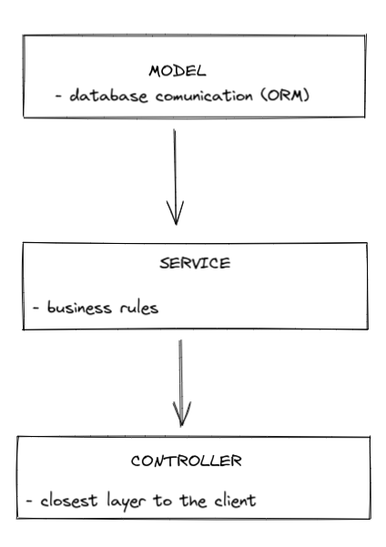

# Ik Appointments API - Backend

Essa é uma proposta de solução para o desafio técnico do processo seletivo da empresa Ik Solution.

## Table of contents

- [Overview](#overview)
  - [The challenge](#the-challenge)
  - [Screenshot](#screenshot)
  - [Links](#links)
- [My process](#my-process)
  - [Built with](#built-with)
  - [What I learned](#what-i-learned)
- [Author](#author)

## Overview

### The challenge

Usuários deveriam ser capazes de:

- Criar uma tarefa/appointment com título e data.
- Utilizar features de CRUD (criar, listar, atualizar e deletar).

### Links

- Live Site URL: [Site URL](https://appointments-ik-frontend.herokuapp.com/)

### Software Architecture

## My process

### Built with

- [Express.js](https://expressjs.com/pt-br/) - Node.js Framework
- [MySQL](https://www.mysql.com/) - Relational database
- [Sequelize](https://sequelize.org/) - ORM
- [Mocha.js](https://mochajs.org/) - Testing Library
- [Sinon.js](https://sinonjs.org/) - Standalone test spies, stubs and mocks for JavaScript.
- [ESLint](https://eslint.org/) - A pluggable and configurable linter tool for identifying and reporting on patterns in JavaScript.

### What I learned

Com este projeto pude praticar minhas habilidades básicas de backend com Node.js, consumindo um banco de dados MYSQL. 

## Author

- Linkedin - [Gabriel Prates Peralta](https://www.linkedin.com/in/gabriel-pperalta/)
